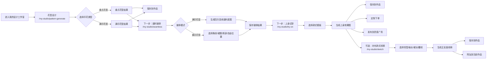
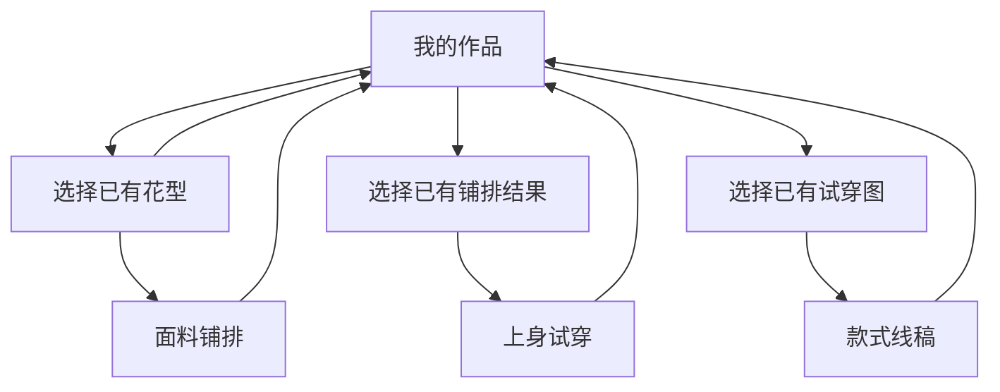

# MaxLuLu AI · 我的设计工作室 4 个 AI 创作工具页面设计规范与交互说明

适用页面：

- `/my-studio/pattern-generate` 花型设计
- `/my-studio/seamless` 面料铺排
- `/my-studio/try-on` 上身试穿
- `/my-studio/sketch` 款式线稿

设计定位：消费者端轻量 AI 创作工具，不是专业设计师后台。用户看到的是“简单好玩的创作体验”，系统在背后处理工艺、色彩、面料与生产可行性。

---

## 0. 全局设计基础

### 0.1 品牌基调

| 项目 | 规范 |
|---|---|
| 品牌气质 | 高端女装品牌 + AI 印花创作平台 |
| 关键词 | 知性、克制、现代、高级、上海都市感、印花女性力量 |
| 页面感受 | 像时装品牌的创作体验页，不像 SaaS 工具后台 |
| 视觉重点 | 留白、柔和卡片、花卉插画、作品图、轻量交互 |
| 禁止 | 淘宝式大促色、重阴影、廉价渐变、过度工程化表单 |

### 0.2 全局配色系统

| 用途 | Token | 色值 | 使用位置 |
|---|---|---:|---|
| 品牌主色 | Primary / Porcelain Cyan | `#234A58` | 导航激活、主视觉文字、选中态、重点标题 |
| 主色 Hover | Primary Deep | `#235660` | 深色按钮 hover、重点图标 |
| 主色浅底 | Primary Subtle | `#E2EEF1` | 选中背景、浅蓝工具卡、信息提示 |
| 强调色 | Accent / Smoked Rose | `#C06A73` | 主 CTA、生成按钮、保存按钮、创作入口 |
| 强调 Hover | Accent Hover | `#AB5760` | CTA hover / pressed |
| 强调浅底 | Accent Subtle | `#F4E5E7` | 弱强调背景、浅玫瑰卡片、提示底色 |
| 认证金 | Certified Gold | `#C8A875` | 认证提示、轻量工艺建议、身份相关 |
| 页面背景 | Background | `#F3F6F6` | 页面整体背景 |
| 卡片背景 | Surface | `#FCFDFD` | 面板、工具卡、结果区、导航 |
| 浮层背景 | Surface Elevated | `#FFFFFF` | Modal、移动端底栏、浮层 |
| 浅色块 | Subtle | `#E6ECEC` | 禁用背景、弱分区 |
| 主文字 | Text Primary | `#1E272B` | 页面标题、卡片标题、核心正文 |
| 正文 | Text Secondary | `#566469` | 描述、参数说明 |
| 弱文字 | Text Tertiary | `#879397` | 时间、计数、说明 |
| 禁用文字 | Text Disabled | `#BECCCA` | 禁用态 |
| 反白文字 | Text Inverse | `#FFFFFF` | 深色按钮文字 |
| 边框 | Border | `#D2DEDF` | 卡片、输入框、选项卡 |
| 强边框 | Border Strong | `#B8C7CA` | hover / active |
| 分割线 | Divider | `#E1E8E8` | 模块分隔 |
| 成功 | Success | `#2F7D68` | 保存成功、已生成 |
| 警告 | Warning | `#E2A23A` | 色彩丰富 / 工艺建议提示 |
| 错误 | Error | `#E57373` | 生成失败、超限强提示 |
| 信息 | Info | `#4B8FE3` | AI 状态提示 |

### 0.3 字体系统

| 层级 | Desktop 字号 / 行高 | Mobile 字号 / 行高 | 字重 | 字体 | 使用位置 |
|---|---:|---:|---:|---|---|
| Display | `48 / 56px` | `32 / 40px` | 400 | Playfair Display / Noto Serif SC | 页面展示标题 |
| H1 | `40 / 48px` | `28 / 36px` | 400 | Noto Serif SC | 工具页面主标题 |
| H2 | `32 / 40px` | `24 / 32px` | 400 | Noto Serif SC | 大模块标题 |
| H3 | `20 / 28px` | `18 / 26px` | 500 | Noto Serif SC / Noto Sans SC | 面板标题、卡片标题 |
| Body | `14 / 22px` | `14 / 22px` | 400 | Inter / Noto Sans SC | 正文、说明 |
| Body Small | `13 / 20px` | `13 / 20px` | 400 | Inter / Noto Sans SC | 参数、历史记录 |
| Caption | `12 / 18px` | `12 / 18px` | 400 | Inter / Noto Sans SC | 计数、时间、辅助 |
| Button | `14 / 20px` | `14 / 20px` | 600 | Inter / Noto Sans SC | 按钮 |
| Metric | `22 / 28px` | `20 / 28px` | 400 | Playfair Display | 计数、额度 |

数字统一使用：

```css
font-variant-numeric: tabular-nums;
font-feature-settings: "tnum" 1, "lnum" 1;
```

### 0.4 间距系统

| Token | 数值 | 使用位置 |
|---|---:|---|
| Space 1 | `4px` | 图标与文字微间距 |
| Space 2 | `8px` | 小组件内距、chip gap |
| Space 3 | `12px` | 标签、卡片内部小间距 |
| Space 4 | `16px` | 移动端边距、卡片内距 |
| Space 6 | `24px` | 卡片间距、模块内间距 |
| Space 8 | `32px` | 中模块间距 |
| Space 10 | `40px` | 大模块间距 |
| Space 12 | `48px` | 页面区块间距 |
| Space 16 | `64px` | Hero / 大留白 |
| Space 20 | `80px` | 大页面留白 |

### 0.5 圆角与阴影

| Token | 值 | 使用位置 |
|---|---:|---|
| Radius XS | `2px` | 装饰线 |
| Radius S | `4px` | 小标签 |
| Radius M | `8px` | 按钮、输入框、chip |
| Radius L | `12px` | 卡片、面板 |
| Radius XL | `16px` | 大面板、结果区 |
| Radius 2XL | `20px` | 页面大容器 |
| Radius Full | `999px` | 胶囊按钮、头像 |

| Token | CSS | 使用位置 |
|---|---|---|
| Shadow XS | `0 1px 2px 0 rgba(30,39,43,0.04)` | 默认卡片 |
| Shadow SM | `0 4px 12px 0 rgba(30,39,43,0.06)` | hover 卡片 |
| Shadow MD | `0 8px 24px 0 rgba(30,39,43,0.08)` | 浮层、抽屉 |
| Shadow LG | `0 16px 40px 0 rgba(30,39,43,0.12)` | Modal、大展示板 |

### 0.6 工具页面通用布局

| 区域 | Desktop | Mobile |
|---|---|---|
| 页面画板 | `1440 × 900` | `375 × 800` |
| 内容最大宽度 | `1180–1200px` | `calc(100vw - 32px)` |
| 页面边距 | `40–64px` | `16px` |
| 顶部导航 | `64px` 高 | `56px` 高，Logo + Menu |
| 主页面卡片 | `border-radius: 20px` | 无外层大壳或小圆角卡片堆叠 |
| 工作区布局 | 3 列：左 35–40% / 中 40–45% / 右 20% | 单列堆叠 |
| 底部串联提示 | Desktop 横条 | Mobile 卡片 / 底部提示 |

Desktop 推荐结构：

```text
ConsumerNav
→ Page Header / Breadcrumb
→ Workspace Shell
   ├── Left Input Panel
   ├── Center Result Preview
   └── Right Action Panel
→ Bottom Next-Step Banner
```

---

## 1. `/my-studio/pattern-generate` 花型设计规范

### 1.1 页面目标

让用户用一句话描述花卉灵感，选择风格与印花类型，AI 生成 1–4 张花型结果。

### 1.2 页面配色

| 用途 | 色值 | 使用位置 |
|---|---:|---|
| 页面背景 | `#F3F6F6` | 页面底 |
| 主卡片 | `#FCFDFD` | 工作台大容器 |
| 输入面板 | `#FCFDFD` | 左侧输入区 |
| 结果面板 | `#FFFFFF` | 中间结果区 |
| 右侧操作面板 | `#FCFDFD` | 保存 / 下一步 / 历史 |
| 主 CTA | `#C06A73` | “开始设计”“保存到作品” |
| CTA Hover | `#AB5760` | hover |
| 选中边框 | `#C06A73` | 选中花型、选中 chip |
| 选中浅底 | `#F4E5E7` | 风格标签 selected |
| 轻提示背景 | `rgba(200,168,117,0.12)` | 工艺建议提示 |
| 轻提示文字 | `#A8874F` | 工艺建议文案 |
| 标题文字 | `#1E272B` | 标题 |
| 正文文字 | `#566469` | 描述 |
| 辅助文字 | `#879397` | 字数、历史时间 |
| 边框 | `#D2DEDF` | 卡片、输入框 |
| 分割线 | `#E1E8E8` | 区块分隔 |

### 1.3 字号

| 元素 | Desktop | Mobile | 字重 | 颜色 |
|---|---:|---:|---:|---|
| 页面标题 | `40/48px` | `28/36px` | 400 | `#1E272B` |
| 英文路由标题 | `32/40px` | `22/30px` | 400 | `#1E272B` |
| 面包屑 | `13/20px` | `12/18px` | 400 | `#879397` |
| 面板标题 | `18/26px` | `16/24px` | 500 | `#1E272B` |
| 步骤编号 | `12/18px` | `12/18px` | 600 | `#FFFFFF` |
| 输入框文字 | `14/22px` | `14/22px` | 400 | `#1E272B` |
| Chip | `13/20px` | `12/18px` | 500 | `#566469` |
| 结果标题 | `18/26px` | `16/24px` | 500 | `#1E272B` |
| 历史标题 | `14/22px` | `13/20px` | 500 | `#1E272B` |
| 历史时间 | `12/18px` | `12/18px` | 400 | `#879397` |
| 主按钮 | `14/20px` | `14/20px` | 600 | `#FFFFFF` |

### 1.4 间距与布局

| 位置 | Desktop | Mobile |
|---|---:|---:|
| 页面上边距 | `32px` | `16px` |
| 主工作台 padding | `32px` | `16px` |
| 三栏 gap | `24px` | `16px` |
| 左侧面板宽度 | `35–40%` | `100%` |
| 中间结果宽度 | `40–45%` | `100%` |
| 右侧操作宽度 | `20%` | `100%` |
| 面板内边距 | `24px` | `16px` |
| 表单项间距 | `20px` | `16px` |
| Chip gap | `8px` | `8px` |
| 结果图 grid gap | `12px` | `8px` |
| 底部串联 banner margin-top | `24px` | `16px` |

### 1.5 组件样式

#### 输入描述框

| 属性 | 值 |
|---|---|
| 高度 | `140px` Desktop / `96px` Mobile |
| 背景 | `#FFFFFF` |
| 边框 | `1px solid #D2DEDF` |
| 聚焦边框 | `1px solid #234A58` |
| 圆角 | `12px` |
| 内边距 | `16px` |
| Placeholder | `#879397` |
| 字数计数 | 右下角 `12px #879397` |

#### 风格 Chip

| 状态 | 背景 | 文字 | 边框 |
|---|---:|---:|---|
| Default | `#FFFFFF` | `#566469` | `1px solid #D2DEDF` |
| Hover | `#F3F6F6` | `#234A58` | `1px solid #B8C7CA` |
| Selected | `#F4E5E7` | `#C06A73` | `1px solid #C06A73` |
| Disabled | `#F3F6F6` | `#BECCCA` | `1px solid #E1E8E8` |

尺寸：`32px` 高，`999px` 圆角，左右 `14–16px`。

#### 印花类型卡

| 属性 | 值 |
|---|---|
| 高度 | `88px` Desktop / `72px` Mobile |
| 背景 | `#FFFFFF` |
| 边框 | 默认 `#D2DEDF`，选中 `#C06A73` |
| 选中背景 | `#F4E5E7` 的低透明度 |
| 圆角 | `12px` |
| 内边距 | `14px` |
| 图标 | `28px`，线性 `1.5px` |
| 标题 | `14/22px 500` |
| 描述 | `12/18px #879397` |

#### 结果图卡

| 属性 | 值 |
|---|---|
| 布局 | `2 × 2` |
| 图片比例 | `1:1` |
| 圆角 | `12px` |
| 默认边框 | `1px solid #D2DEDF` |
| 选中边框 | `2px solid #C06A73` |
| 选中角标 | 右上角 `24px` 圆形，背景 `#C06A73` |
| hover | `transform: translateY(-2px)` + Shadow SM |

#### 右侧操作卡

| 属性 | 值 |
|---|---|
| 宽度 | `20%` |
| 背景 | `#FCFDFD` |
| 边框 | `1px solid #D2DEDF` |
| 圆角 | `16px` |
| 内边距 | `20px` |
| 主按钮高度 | `44px` |
| 次按钮高度 | `40px` |
| 按钮圆角 | `8px` |

### 1.6 状态设计

| 状态 | 页面表现 |
|---|---|
| 默认 | 左侧输入可编辑，中间空态引导，右侧操作按钮 disabled |
| Loading | 中间显示品牌花瓣 loading，CTA 显示“设计中…”并禁用 |
| 结果 | 中间展示 4 张结果，默认选中第一张，右侧保存 / 下一步可用 |
| 空状态 | 中间显示淡花卉插画 + “描述你的第一朵花型灵感” |
| 错误 | 顶部提示条：`生成失败了，可以换一种描述再试一次` + 重试 |
| 工艺建议 | 金色浅底提示：`这个花型色彩丰富，建议使用数码印花工艺效果更好` |
| 色数超限 | 友好提示：`这个花型色彩比较丰富，更适合使用数码印花呈现`，不显示专业报错 |

---

## 2. `/my-studio/seamless` 面料铺排规范

### 2.1 页面目标

将花型转换为满印面料铺排，或为重点花型生成服装定位示意。

### 2.2 页面配色

| 用途 | 色值 | 使用位置 |
|---|---:|---|
| 主 CTA | `#C06A73` | “生成铺排”“保存到作品” |
| 当前 Tab | `#C06A73` | 面料预览 active |
| Slider 轨道 | `#E1E8E8` | 参数调节 |
| Slider 进度 | `#C06A73` | 当前值 |
| Slider Thumb | `#FFFFFF` + `#C06A73` border | 拖动点 |
| 选中模式背景 | `#F4E5E7` | 满印 / 重点 selected |
| 结果预览背景 | `#FFFFFF` | 面料画布 |
| 工艺提示背景 | `rgba(200,168,117,0.12)` | 自动铺排提示 |
| 色板边框 | `#D2DEDF` | 背景色选项 |

### 2.3 字号

| 元素 | Desktop | Mobile | 字重 |
|---|---:|---:|---:|
| 页面标题 | `40/48px` | `28/36px` | 400 |
| 面板标题 | `18/26px` | `16/24px` | 500 |
| 模式标题 | `14/22px` | `13/20px` | 500 |
| 参数标签 | `13/20px` | `13/20px` | 500 |
| 参数值 | `13/20px` | `13/20px` | 400 |
| Tab | `14/22px` | `13/20px` | 500 |
| 主按钮 | `14/20px` | `14/20px` | 600 |

### 2.4 间距与布局

| 位置 | Desktop | Mobile |
|---|---:|---:|
| 源花型卡高度 | `92px` | `88px` |
| 模式卡高度 | `64px` | `56px` |
| Slider 组间距 | `20px` | `16px` |
| 色板尺寸 | `28px` | `28px` |
| 色板 gap | `8px` | `8px` |
| 中间预览画布 | `520–560px` 宽 | `100%` |
| 预览画布比例 | `4:3` / `1:1` 根据页面 | `4:3` |
| 底部操作栏 | `48px` 高 | 卡片内堆叠 |

### 2.5 组件样式

#### 源花型选择卡

| 属性 | 值 |
|---|---|
| 图片尺寸 | `72 × 72px` |
| 圆角 | `8px` |
| 标题 | `14/22px 500` |
| 时间 | `12/18px #879397` |
| 按钮 | 小型次按钮，`32px` 高 |

#### 铺排模式卡

| 状态 | 背景 | 文字 | 边框 |
|---|---:|---:|---|
| Default | `#FFFFFF` | `#566469` | `1px solid #D2DEDF` |
| Selected | `#F4E5E7` | `#C06A73` | `1px solid #C06A73` |

#### Slider

| 属性 | 值 |
|---|---|
| 高度 | `32px` 操作区域 |
| 轨道高 | `2px` |
| 轨道色 | `#E1E8E8` |
| 进度色 | `#C06A73` |
| thumb | `16px` 圆形，白底，`2px solid #C06A73` |
| 数值 | 右侧 `13px #566469` |

#### 面料预览画布

| 属性 | 值 |
|---|---|
| 背景 | `#FFFFFF` |
| 圆角 | `16px` |
| 边框 | `1px solid #D2DEDF` |
| 图片比例 | Desktop `4:3` 或 `1:1`，Mobile `4:3` |
| 图片裁切 | `object-fit: cover` |
| 控制栏 | 下方居中，`12px #879397` |

### 2.6 状态设计

| 状态 | 页面表现 |
|---|---|
| 默认 | 未选择源花型时左侧显示“选择一个花型开始铺排” |
| Loading | 画布显示柔和花瓣铺开动画，按钮“生成中…” |
| 满印结果 | 中间大画布展示无缝重复图案，可缩放 / 调密度 |
| 重点花型结果 | 中间展示连衣裙轮廓 + 位置示意点 |
| 空状态 | 没有花型时提示“先去设计一朵花型” |
| 错误 | 提示“铺排失败，请换一个花型或降低密度” |
| 轻提示 | `已为你自动生成适合面料印花的铺排效果` |
| 参数超限 | 友好提示“当前花型过密，成衣上可能显得拥挤，建议降低疏密” |

---

## 3. `/my-studio/try-on` 上身试穿规范

### 3.1 页面目标

将面料铺排效果应用到款式模板上，生成上身效果图，并引导保存、下单或发布。

### 3.2 页面配色

| 用途 | 色值 | 使用位置 |
|---|---:|---|
| 主 CTA | `#C06A73` | “开始试穿”“保存到作品” |
| 下单强调 | `#C06A73` | “定制下单” |
| 发布入口 | `#566469` / `#C06A73` | 发布到灵感广场 |
| 版型选中边框 | `#C06A73` | A 字裙选中 |
| 版型浅底 | `#F4E5E7` | 选中模板 |
| 提示背景 | `rgba(200,168,117,0.12)` | 自动贴合提示 |
| 预览背景 | `#FFFFFF` | 模特图区域 |
| 缩略图边框 | `#D2DEDF` | 侧面图 / 轮播图 |

### 3.3 字号

| 元素 | Desktop | Mobile | 字重 |
|---|---:|---:|---:|
| 页面标题 | `40/48px` | `28/36px` | 400 |
| 预览标题 | `20/28px` | `18/26px` | 500 |
| 版型名称 | `13/20px` | `12/18px` | 500 |
| 参数 chip | `13/20px` | `12/18px` | 500 |
| 历史记录 | `13/20px` | `12/18px` | 400 |
| CTA | `14/20px` | `14/20px` | 600 |

### 3.4 间距与布局

| 位置 | Desktop | Mobile |
|---|---:|---:|
| 版型卡尺寸 | `84 × 112px` | `72 × 92px` |
| 版型卡 gap | `12px` | `8px` |
| 参数 chip 高度 | `32px` | `30px` |
| 主预览图宽度 | `60–65%` 中央预览区 | `100%` |
| 侧面图宽度 | `28–32%` | `36–40%` 与主图并排或下方 |
| 预览图圆角 | `14px` | `12px` |
| 操作按钮间距 | `12px` | `8px` |

### 3.5 组件样式

#### 版型选择卡

| 属性 | 值 |
|---|---|
| 背景 | `#FFFFFF` |
| 选中背景 | `#F4E5E7` |
| 边框 | 默认 `#D2DEDF`，选中 `#C06A73` |
| 圆角 | `12px` |
| 图标 | `48px` Desktop / `40px` Mobile |
| 选中角标 | 右上 `20px`，背景 `#C06A73` |
| hover | Shadow XS + border strong |

#### 试穿预览图

| 属性 | 值 |
|---|---|
| 主图比例 | `3:4` |
| 侧面图比例 | `3:4` |
| 圆角 | `14px` |
| 背景 | `#FFFFFF` |
| 图片裁切 | `object-fit: cover` |
| 轮播点 | `6px` 圆点，active `#C06A73` |

#### 操作按钮组

| 操作 | 样式 |
|---|---|
| 保存到作品 | Primary Button |
| 定制下单 | Secondary Button + Accent icon |
| 发布到灵感广场 | Secondary Button |
| Mobile | 三按钮可以横向图标按钮或纵向卡片 |

### 3.6 状态设计

| 状态 | 页面表现 |
|---|---|
| 默认 | 未选版型时，中心显示“选择一个款式模板开始试穿” |
| Loading | 模特图区域显示柔和上身生成动画，文案“正在把花型贴合到版型上…” |
| 结果 | 展示正面主图 + 侧面缩略图 / 轮播 |
| 空状态 | 没有面料来源时提示“先完成面料铺排” |
| 错误 | “试穿生成失败，可以换一个版型再试一次” |
| 自动贴合提示 | `已为你自动贴合花型与版型，效果可直接用于定制参考` |
| 下单提示 | 点击定制下单前确认作品已保存 |

---

## 4. `/my-studio/sketch` 款式线稿规范

### 4.1 页面目标

让用户选择领型、袖长、裙长与腰线，生成正反面款式线稿，可保存或附加到当前作品。

### 4.2 页面配色

| 用途 | 色值 | 使用位置 |
|---|---:|---|
| 主 CTA | `#C06A73` | “生成线稿”“保存到作品” |
| 选中参数 | `#C06A73` | chip border / icon |
| 选中背景 | `#F4E5E7` | 参数 selected |
| 线稿色 | `#9B7A68` / `#879397` | 正反面线稿 |
| 预览背景 | `#FFFFFF` | 线稿画布 |
| 辅助提示 | `rgba(200,168,117,0.12)` | 线稿可用于定制参考 |
| 完成提示背景 | `#FCF7F3` | 底部完成链路 banner |

### 4.3 字号

| 元素 | Desktop | Mobile | 字重 |
|---|---:|---:|---:|
| 页面标题 | `40/48px` | `28/36px` | 400 |
| 参数组标题 | `14/22px` | `13/20px` | 500 |
| 参数选项 | `12/18px` | `12/18px` | 500 |
| 预览标题 | `18/26px` | `16/24px` | 500 |
| Front / Back 标注 | `13/20px` | `12/18px` | 400 |
| 提示文字 | `13/20px` | `12/18px` | 400 |
| CTA | `14/20px` | `14/20px` | 600 |

### 4.4 间距与布局

| 位置 | Desktop | Mobile |
|---|---:|---:|
| 参数组间距 | `20px` | `16px` |
| 参数选项 gap | `8px` | `8px` |
| 参数卡高度 | `64px` | `40–48px` |
| 输入框高度 | `96px` | `80px` |
| 预览画布高度 | `480–520px` | `360–420px` |
| 线稿间距 | `48px` | `24px` |
| 缩略图高度 | `64px` | `52px` |

### 4.5 组件样式

#### 参数选项卡

| 属性 | 值 |
|---|---|
| 背景 | `#FFFFFF` |
| 选中背景 | `#F4E5E7` |
| 边框 | 默认 `#D2DEDF`，选中 `#C06A73` |
| 圆角 | `8px` |
| 图标尺寸 | `28–32px` |
| 文字 | `12/18px` |
| 高度 | `64px` Desktop / `40–48px` Mobile |

#### 文字描述输入

| 属性 | 值 |
|---|---|
| 高度 | `96px` Desktop / `80px` Mobile |
| 背景 | `#FFFFFF` |
| 边框 | `1px solid #D2DEDF` |
| 聚焦 | `1px solid #234A58` |
| 圆角 | `12px` |
| 内边距 | `14px` |

#### 线稿预览画布

| 属性 | 值 |
|---|---|
| 背景 | `#FFFFFF` |
| 圆角 | `16px` |
| 边框 | `1px solid #D2DEDF` |
| 内边距 | `32px` |
| 布局 | Front / Back 双图并排 |
| 线稿色 | warm taupe `#9B7A68` 或 blue-gray `#879397` |
| 标签 | 顶部居中 `正面 / Front`、`背面 / Back` |

### 4.6 状态设计

| 状态 | 页面表现 |
|---|---|
| 默认 | 参数默认选中常见连衣裙组合 |
| Loading | 中间画布出现线条逐渐绘制动画 |
| 结果 | 正反面线稿并排展示，可切换方案 |
| 空状态 | 未选参数时显示“选择几个款式参数，生成你的第一张线稿” |
| 错误 | “线稿生成失败，请减少参数或换一种描述” |
| 保存成功 | “线稿已保存到你的设计工作室” |
| 附加成功 | “已附加到当前作品，可在定制下单时查看” |

---

## 5. 工具串联流程示意图

### 5.1 主链路



### 5.2 分支与返回



### 5.3 数据产物流

| 步骤 | 输入 | 输出 | 下一步 |
|---|---|---|---|
| 花型设计 | Prompt、风格、印花类型 | 花型图案、推荐工艺、色彩复杂度 | 保存 / 面料铺排 |
| 面料铺排 | 花型图案、铺排模式、缩放、密度 | 面料底图 / 定位花示意图 | 保存 / 上身试穿 |
| 上身试穿 | 铺排结果、款式模板 | 正面上身图、侧面图 | 保存 / 下单 / 发布 / 线稿 |
| 款式线稿 | 款式参数、描述 | 正反面线稿 | 保存 / 附加作品 |

---

## 6. 全局状态设计

### 6.1 默认状态

| 页面 | 默认表现 |
|---|---|
| 花型设计 | 左侧输入框可编辑，中间显示空态引导，右侧操作 disabled |
| 面料铺排 | 没有上一步结果时，引导从作品选择花型 |
| 上身试穿 | 没有铺排结果时，引导先完成面料铺排 |
| 款式线稿 | 默认选中一套常用参数，允许直接生成 |

### 6.2 Loading 状态

| 组件 | 规范 |
|---|---|
| 页面按钮 | 显示“生成中…”并禁用 |
| 结果区 | 使用品牌花瓣 / 线条生成动画，不用普通 spinner |
| Skeleton | 图片结果用柔和骨架屏，背景 `#F4E5E7` / `#E2EEF1` 低透明 |
| 文案 | 花型设计：`AI 正在为你描绘花型…`；面料铺排：`正在把花型铺成面料…`；试穿：`正在贴合花型与版型…`；线稿：`正在绘制正反面线稿…` |
| 动效 | `240ms ease-out` fade + subtle scale，不闪烁 |

### 6.3 结果状态

| 页面 | 结果表现 |
|---|---|
| 花型设计 | 2×2 结果图，选中态高亮，可换一组 |
| 面料铺排 | 大画布预览面料，支持缩放和密度 |
| 上身试穿 | 主图 + 侧图 / 轮播点 |
| 款式线稿 | Front / Back 正反面线稿并排 |

### 6.4 空状态

| 页面 | 空状态文案 | CTA |
|---|---|---|
| 花型设计 | `描述你的第一朵花型灵感` | `开始设计` |
| 面料铺排 | `还没有可铺排的花型` | `去设计花型` |
| 上身试穿 | `还没有可试穿的面料效果` | `去面料铺排` |
| 款式线稿 | `选择几个款式参数，生成你的第一张线稿` | `生成线稿` |

空状态视觉：

| 属性 | 值 |
|---|---|
| 背景 | `#FCFDFD` |
| 边框 | `1px solid #D2DEDF` |
| 圆角 | `16px` |
| 插画 | `120–180px`，线稿 / 花卉 |
| 标题 | `20/28px` |
| 文案 | `14/22px #566469` |
| CTA | Primary Button |

### 6.5 错误 / 引导状态

| 类型 | 文案 | 样式 |
|---|---|---|
| 生成失败 | `生成失败了，可以换一种描述再试一次` | `#F4E5E7` 背景，`#C06A73` 文字 |
| 网络错误 | `网络有点慢，请稍后重试` | Info / Error 轻提示 |
| 参数超限 | `当前花型过密，成衣上可能显得拥挤，建议降低疏密` | Warning 浅底 |
| 色彩复杂 | `这个花型色彩丰富，建议使用数码印花工艺效果更好` | Certified Gold 浅底 |
| 保存失败 | `保存失败，请稍后再试` | Error |
| 未登录 | `登录后可以保存你的设计作品` | 弹窗 / Toast + 登录 CTA |

### 6.6 Toast

| 类型 | 背景 | 文字 | 图标 | 时长 |
|---|---:|---:|---|---:|
| Success | `#FFFFFF` | `#2F7D68` | check | `2400ms` |
| Warning | `#FFFFFF` | `#E2A23A` | sparkle / info | `3200ms` |
| Error | `#FFFFFF` | `#E57373` | alert | `3200ms` |
| Info | `#FFFFFF` | `#4B8FE3` | info | `2400ms` |

Toast 样式：`border: 1px solid #D2DEDF; border-radius: 12px; box-shadow: 0 8px 24px rgba(30,39,43,0.08);`

---

## 7. 开发落地建议

### 7.1 推荐组件拆分

```text
components/ai-studio/
├── AiStudioShell.tsx
├── AiStudioBreadcrumb.tsx
├── StepPanel.tsx
├── PromptInput.tsx
├── StyleChips.tsx
├── PrintTypeSelector.tsx
├── PatternResultGrid.tsx
├── SeamlessPreviewCanvas.tsx
├── TryOnPreview.tsx
├── SketchPreview.tsx
├── ActionPanel.tsx
├── RecentHistoryList.tsx
├── NextStepBanner.tsx
├── AiLoadingState.tsx
├── AiEmptyState.tsx
└── AiGuidanceBanner.tsx
```

### 7.2 通用 CSS Class 命名建议

```text
.aiStudioPage
.aiStudioShell
.aiStudioWorkspace
.aiStudioPanel
.aiStudioPanel__header
.aiStudioStepBadge
.aiStudioPrimaryButton
.aiStudioSecondaryButton
.aiStudioGuidance
.aiStudioResultGrid
.aiStudioActionPanel
.aiStudioHistory
.aiStudioNextBanner
```

### 7.3 API 交互建议

统一接口：

```text
POST /api/ai-studio/generate
```

请求中通过 `toolType` 区分工具：

```ts
type AiStudioToolType =
  | "pattern-generate"
  | "seamless"
  | "try-on"
  | "sketch";
```

通用请求结构：

```ts
type AiStudioGenerateRequest = {
  toolType: AiStudioToolType;
  prompt?: string;
  sourceWorkId?: string;
  sourceImageUrl?: string;
  printType?: "placement" | "allover";
  params?: Record<string, string | number | boolean>;
};
```

通用返回结构：

```ts
type AiStudioGenerateResponse = {
  id: string;
  toolType: AiStudioToolType;
  status: "success" | "failed" | "processing";
  images: string[];
  recommendation?: {
    type: "info" | "warning" | "craft";
    message: string;
  };
  nextStep?: {
    label: string;
    href: string;
  };
};
```

---

## 8. 最终验收清单

### 8.1 视觉验收

```text
[ ] 页面整体不像 SaaS 后台，而像高端女装品牌创作工具
[ ] 四个工具页面视觉风格统一
[ ] Desktop 三栏布局清晰
[ ] Mobile 单列堆叠自然
[ ] 主 CTA 都使用 Smoked Rose
[ ] 工艺提示是友好引导，不是错误警告
[ ] 结果图展示面积足够大
[ ] 右侧操作区不喧宾夺主
[ ] 历史记录轻量但可用
[ ] 底部串联提示清晰
```

### 8.2 交互验收

```text
[ ] 用户可以从花型设计进入面料铺排
[ ] 用户可以从面料铺排进入上身试穿
[ ] 用户可以从上身试穿进入定制下单 / 发布 / 线稿
[ ] 用户可以独立进入款式线稿
[ ] 每个页面都有保存到作品
[ ] Loading / Empty / Error 状态完整
[ ] 参数超限是友好引导
[ ] 不向消费者暴露复杂生产工艺术语
```

### 8.3 响应式验收

```text
[ ] 1440×900 下桌面工作区完整展示
[ ] 1024–1280 下三栏能合理压缩或切换
[ ] 375×800 下输入、结果、操作顺序清晰
[ ] 移动端 CTA 不被隐藏
[ ] 移动端底部导航不遮挡主要操作
```

